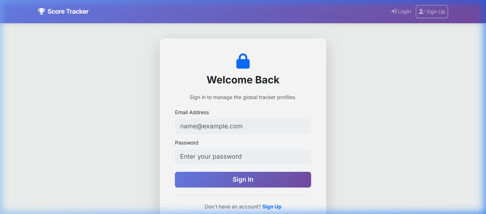
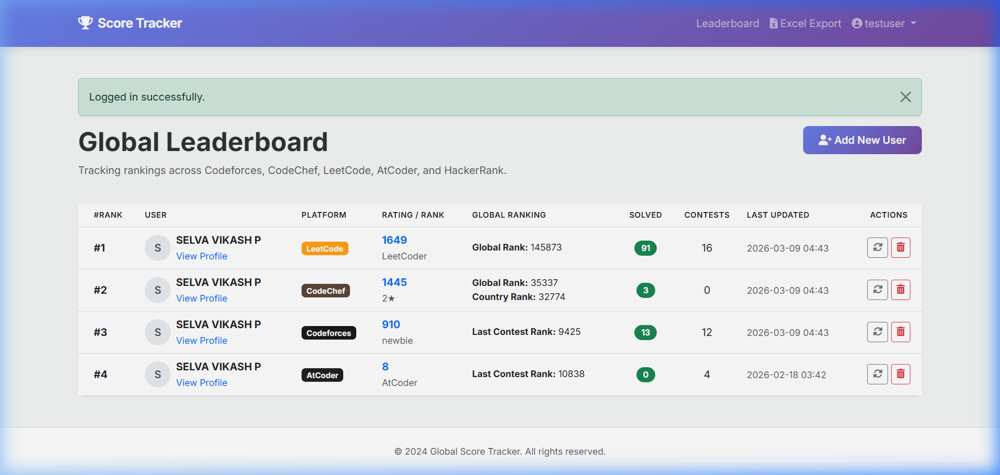

# Global Platform Score Tracker

A unified dashboard to track your competitive programming and coding platform statistics all in one place.

**Live Deployment:** [https://score-tracker-global.onrender.com](https://score-tracker-global.onrender.com)  
**GitHub Repository:** [https://github.com/SelvavikashP/score_tracker_global](https://github.com/SelvavikashP/score_tracker_global)

## Overview

The Global Platform Score Tracker allows you to easily monitor your rankings, ratings, overall problems solved, and total contests participated across major coding platforms like Codeforces, CodeChef, LeetCode, AtCoder, and HackerRank. 

Instead of visiting each website individually, you can instantly see an aggregated view of your performance and download clean Excel reports.

## Features

- **Multi-Platform Sync**: Pulls real-time statistics from top coding platforms.
- **Account Isolation**: Securely save your handles to your own private account.
- **One-Click Sync**: Easily refresh all your platform scores across the board simultaneously.
- **Excel Export**: Download an elegant `.xlsx` report of your current standings for quick sharing or record-keeping.
- **Dark Mode UI**: Clean, high-contrast interface designed for extended reading and professional appearance.

## Sample Screenshots

### Login & Authentication


### Live Aggregated Leaderboard


## Local Setup

To run this project locally on your machine:

1. Clone the repository:
   ```bash
   git clone https://github.com/SelvavikashP/score_tracker_global.git
   cd score_tracker_global
   ```

2. Install the required Python packages:
   ```bash
   pip install -r requirements.txt
   ```

3. Start the Flask application:
   ```bash
   python app.py
   ```

4. Open your browser and go to `http://127.0.0.1:5000`.

## Notes
Built with Python, Flask, Bootstrap 5, and SQLite. Deployed on Render.
